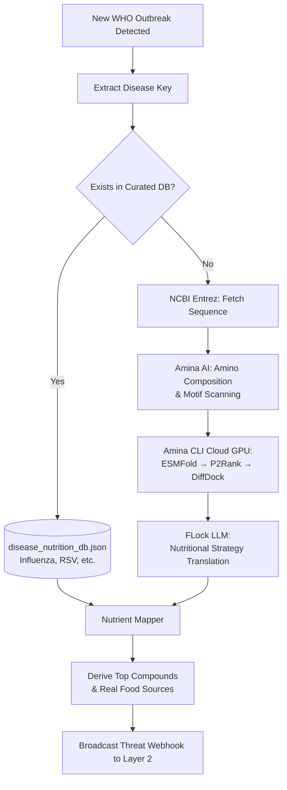

[](https://www.python.org/)
[](https://fastapi.tiangolo.com/)
[](https://opensource.org/licenses/MIT)
[](#privacy--security)
> **NutriShield** Privacy-first, AI-powered meal orchestration that adapts in real-time to local disease outbreaks, air pollution, and weather threats.

NutriShield is an autonomous biodefense nutrition assistant. By continuously monitoring environmental threat vectors—such as WHO disease outbreak data, real-time air quality indices, and severe weather patterns—NutriShield dynamically generates and pushes hyper-personalized, evidence-based meal plans to fortify the user's immune system against specific local risks.

Built for the **OpenClaw Hackathon 2026**.
---

## 🚀 Key Features

* **Omnichannel Delivery:** Seamless integration across Telegram, Discord, WhatsApp, Slack, and WebChat via OpenClaw Gateway.
* **Zero-Knowledge Architecture:** Complete local execution for PII. Health data, macros, and biometric inputs never leave the host device.
* **Live Threat Intelligence:** Automated polling of the WHO Disease Outbreak News (DON) and OpenWeatherMap APIs.
* **Bioinformatics Pipeline:** For novel pathogens, NutriShield autonomously runs protein structure prediction (ESMFold) and molecular docking (DiffDock) via Amina AI to map top antiviral compounds to real-world ingredients.
* **Proactive Alerting:** Background threat evaluation with instant webhook-driven push notifications when regional threat levels escalate.

---

## 🏗️ System Architecture

NutriShield operates on a decoupled, three-tier architecture ensuring strict separation of concerns between user-facing interactions, agent orchestration, and threat intelligence.

```mermaid
graph TD
    User((User Devices\nTelegram, Discord, Web)) <-->|Unified Format| L1
    
    subgraph Layer 1: OpenClaw Gateway :18789
    L1[Multi-Channel Event Router]
    end

    L1 <--> L2
    
    subgraph Layer 2: Orchestration & Agent Bridge :18790
    L2[Intent Router] --> OA[Onboarding Agent\nFLock LLM]
    L2 --> NA[Nutrition Agent\nFLock LLM]
    L2 --> TH[Threat Handler]
    
    OA -.-> LocalData[(Local Profiles JSON\nZero PII Leak)]
    NA -.-> LocalData
    end

    TH -->|GET /threats/{city}| L3
    L3 -- Proactive Webhook\nPOST /threat-alert --> L2

    subgraph Layer 3: Threat Intelligence Backend :8100
    L3[Zero-Knowledge Threat Engine] --> WHO[WHO DON OData API]
    L3 --> OWM[OpenWeatherMap API]
    L3 --> Amina[Amina AI Pipeline\nESMFold / DiffDock]
    end
```

### System Overview

```
  USER (Telegram / Discord / WhatsApp / Slack / WebChat)
    │  "Hey I'm Sarah, 28, trying to lose weight, I live in London"
    │
    ▼
┌──────────────────────────────────────────────────────────────────┐
│  LAYER 1 — OpenClaw Gateway  (:18789)                            │
│                                                                  │
│  ┌──────────┐ ┌──────────┐ ┌──────────┐ ┌──────────┐           │
│  │ Telegram │ │ Discord  │ │ WhatsApp │ │ WebChat  │  ...       │
│  └────┬─────┘ └────┬─────┘ └────┬─────┘ └────┬─────┘           │
│       └────────────┴────────────┴────────────┘                   │
│                         │  Unified message format:               │
│              { text, channel, user_id, chat_id }                 │
└─────────────────────────┼────────────────────────────────────────┘
                          │  POST /hooks/agent
                          ▼
┌──────────────────────────────────────────────────────────────────┐
│  LAYER 2 — Gateway Bridge + Agent Orchestrator  (:18790)         │
│                                                                  │
│  Is profile complete?                                            │
│    NO ──► Onboarding Agent (FLock LLM)                          │
│           • Extracts 9 profile fields from natural conversation  │
│           • Validates all fields locally                         │
│           • Saves to data/profiles/<user_id>.json                │
│           • On complete → auto-subscribe city to Layer 3         │
│           • Calculates TDEE + macros (Mifflin-St Jeor)          │
│                                                                  │
│    YES ─► Intent detection → route to handler:                  │
│           ├── /plan, meal keywords                               │
│           │     Nutrition Agent (FLock LLM)                      │
│           │     • Injects active threats into system prompt      │
│           │     • Generates 3–6 meal schedule per day            │
│           │     • Proactive meal push (background, every 5 min)  │
│           │                                                      │
│           ├── /threats, safety keywords                          │
│           │     Threat Handler                                   │
│           │     • GET /threats/{city}/report → Layer 3           │
│           │     • Forwards pre-formatted report to user          │
│           │     • Chains to Nutrition Agent for meal adaptation  │
│           │                                                      │
│           └── /next, /log, /profile, /link, /reset ...           │
│                 Local tools (meal_manager, profile_manager)      │
│                                                                  │
│  Webhook Receiver (:8200 / :18790)                               │
│    POST /threat-alert ◄── Layer 3 proactive webhook             │
│    → look up users in city → push alert → adapt meal plan        │
│                                                                  │
│  Local Tools: macro_calculator, meal_planner, meal_manager,      │
│               profile_manager, validators, circuit_breaker       │
└─────────────────────────┬────────────────────────────────────────┘
                          │  city name only — no user PII
                          │  POST /subscribe {city, callback_url}
                          │  GET /threats/{city}/report
                          ▼
┌──────────────────────────────────────────────────────────────────┐
│  LAYER 3 — Threat Intelligence Backend  (:8100)   ZERO-KNOWLEDGE │
│                                                                  │
│  Hourly background refresh for 25 UK cities:                     │
│                                                                  │
│  ┌─ THREAT SOURCE 1: Disease Outbreaks (WHO DON) ──────────────┐ │
│  │  WHO OData API → 3-tier geographic filtering:               │ │
│  │    Tier 1 (UK only)     → severity: HIGH                    │ │
│  │    Tier 2 (EURO region) → severity: MODERATE                │ │
│  │    Tier 3 (Global)      → severity: LOW                     │ │
│  │                                                             │ │
│  │  Known disease? ──YES──► disease_nutrition_db.json          │ │
│  │       │                  (11 diseases, direct DB lookup)    │ │
│  │       NO                                                    │ │
│  │       ▼                                                     │ │
│  │  NCBI Entrez → fetch amino acid sequence                    │ │
│  │       │                                                     │ │
│  │       ▼                                                     │ │
│  │  Amina AI — local analysis                                  │ │
│  │    • amino acid composition + 15 motif patterns             │ │
│  │    • 8-factor scoring of 15 phytochemicals                  │ │
│  │       │                                                     │ │
│  │       ▼  (if AMINA_API_KEY set)                             │ │
│  │  Amina CLI — cloud GPU pipeline                             │ │
│  │    • ESMFold   → predict 3D protein structure (.pdb)        │ │
│  │    • P2Rank    → identify binding pockets                   │ │
│  │    • DiffDock  → dock 15 phytochemicals (T4 GPU)            │ │
│  │       │                                                     │ │
│  │       ▼                                                     │ │
│  │  FLock LLM → interpret docking → nutrition strategy JSON    │ │
│  └─────────────────────────────────────────────────────────────┘ │
│                                                                  │
│  ┌─ THREAT SOURCE 2: Environmental Threats ────────────────────┐ │
│  │  OpenWeatherMap AQI API (real-time per city)                │ │
│  │    AQI ≥ 3 (Moderate) → air quality threat + nutrients      │ │
│  │                                                             │ │
│  │  Weather analysis (temperature, humidity, conditions)       │ │
│  │    Heat stress   (>32°C) → electrolyte + hydration advice   │ │
│  │    Cold snap     (<2°C)  → immune support + warming foods   │ │
│  │    High humidity (>80%)  → anti-fungal + mold exposure      │ │
│  │    Storm warning         → non-perishable prep advice       │ │
│  │                                                             │ │
│  │  Seasonal virus calendar (UK, auto-detected by month)       │ │
│  │    Oct–Apr → Norovirus, Influenza, RSV risk tracking        │ │
│  └─────────────────────────────────────────────────────────────┘ │
│                                                                  │
│  For each city — combine all threat sources:                     │
│    ├── Nutrient Mapper (3-tier hybrid)                           │
│    │     1st: disease_nutrition_db.json (known diseases)         │
│    │     2nd: Amina AI / FLock research results (unknown)        │
│    │     3rd: category fallback (air_quality, respiratory, etc.) │
│    ├── SHA-256 fingerprint → detect changes across refresh cycles│
│    └── Pre-format Telegram-ready report text                     │
│                                                                  │
│  On threat change → fire webhook → Layer 2 → user alert          │
│                                                                  │
│  Subscriber registry: { city → [anonymous callback URLs] }       │
│  (zero user data — only city names + callback URLs stored)       │
└──────────────────────────────────────────────────────────────────┘
         │                     │                    │
         ▼                     ▼                    ▼
  ┌─────────────┐     ┌───────────────┐   ┌──────────────────────┐
  │ WHO DON     │     │ NCBI Entrez   │   │ OpenWeatherMap       │
  │ OData API   │     │ Protein DB    │   │ AQI + Weather API    │
  │ (real-time) │     │ (sequences)   │   │ (25 UK cities)       │
  └─────────────┘     └───────────────┘   └──────────────────────┘
```

### Known vs Unknown Disease — Two Different Paths

The Layer 3 Threat Backend dynamically routes mitigation research based on pathogen novelty.



```
New outbreak detected from WHO DON
            │
            ▼
  extract_disease_key(outbreak_title)
            │
     ┌──────┴──────┐
     │             │
   KNOWN         UNKNOWN
     │             │
     ▼             ▼
disease_         NCBI Entrez
nutrition_  →    fetch protein
db.json          sequence
(11 diseases)         │
     │                ▼
     │           Amina AI
     │           local analysis
     │           (motifs, 8-factor
     │            compound score)
     │                │
     │                ▼  (if AMINA_API_KEY)
     │           Amina CLI cloud GPU:
     │           ESMFold → P2Rank → DiffDock
     │                │
     │                ▼
     │           FLock LLM
     │           nutrition strategy
     │                │
     └────────┬───────┘
              ▼
       Nutrient Mapper
       → top compounds
       → food sources
       → meal context
              │
              ▼
      Threat report + webhook
```

**Known diseases** (direct DB — fast, evidence-based):
Influenza, Norovirus, RSV, COVID-19, Measles, Mpox, Legionella, Hay Fever, E. coli, Malaria, Cholera

**Unknown diseases** (full pipeline — AI-powered, slower first run):
Any novel WHO DON outbreak — real example: Chikungunya virus (March 2026 run)
- NCBI fetched QBM78328.1 structural protein (1,248 amino acids)
- ESMFold generated 511,880-byte 3D PDB structure
- P2Rank identified 13 binding pockets (top score: 39.80)
- DiffDock docked 15/15 phytochemicals → top compound: **Resveratrol**

### Proactive Alert Flow (No User Action Required)

```
Layer 3 hourly refresh
        │  SHA-256 fingerprint changed for London
        ▼
_fire_webhooks(["london"])
        │  POST http://127.0.0.1:8200/threat-alert
        │  { city, report_text, active_threats, priority_foods }
        ▼
Layer 2 _handle_proactive_alert()
        │  lookup: _city_users["london"] = {"7599032986"}
        ├─► push report to user's Telegram/Discord
        └─► auto-chain to Nutrition Agent
                → adapts today's meal plan with threat context
                → pushes updated meals to user
```

---

## Tech Stack

| Component | Technology |
|-----------|-----------|
| Multi-channel gateway | OpenClaw 2026.3.2 |
| Agent LLM | FLock API — `qwen3-30b-a3b-instruct-2507` (MoE: 30B params, 3B active) |
| Protein structure prediction | Amina CLI — ESMFold (cloud GPU) |
| Molecular docking | Amina CLI — DiffDock (T4 GPU) |
| Binding site detection | Amina CLI — P2Rank |
| Outbreak surveillance | WHO DON OData API (real-time) |
| Protein sequences | NCBI Entrez API |
| Air quality & weather | OpenWeatherMap AQI API |
| Threat backend | FastAPI + Python 3.12 |
| Local data storage | JSON files (privacy-first, no external DB) |
| Dashboard | Next.js 16, React 19, Tailwind 4 |
| Async HTTP | httpx |

---

## Bounty-Specific Integrations

### FLock API
Used as the LLM brain for **all three agents**:
- **Onboarding Agent** — conversational profile collection (9 health fields via multi-turn dialogue)
- **Nutrition Agent** — threat-aware meal plan generation with TDEE/macro targets and active threat context injected into the system prompt
- **Research Pipeline** — interprets Amina AI protein docking results into actionable food-based nutrition strategies

All calls go to `https://api.flock.io/v1` using the OpenAI-compatible interface with the `x-litellm-api-key` header. Model: `qwen3-30b-a3b-instruct-2507`.

### Amina AI / Amina CLI
Full bioinformatics pipeline for novel pathogen analysis:
- **Sequence Analysis** — motif scanning, amino acid composition analysis, 8-factor compound-pathogen scoring
- **ESMFold** — predicts 3D protein structure from amino acid sequence on cloud GPU
- **P2Rank** — identifies protein binding pockets (candidate drug/nutrient binding sites)
- **DiffDock** — docks 15 candidate phytochemicals against identified binding pockets on T4 GPU

Real example run (Chikungunya virus, detected from WHO DON live data):
- Fetched QBM78328.1 structural protein (1,248 amino acids) from NCBI
- ESMFold generated 511,880-byte PDB structure
- P2Rank found 13 binding pockets (top score: 39.80)
- DiffDock docked 15/15 compounds — top compound: **Resveratrol**
- FLock LLM translated results into meal recommendations (red grapes, peanuts, dark chocolate)

### OpenClaw Gateway
Multi-channel message routing layer:
- Receives messages from Telegram, Discord, WhatsApp, Slack, and built-in web chat
- Claude agent (powered by Anthropic) bridges messages to the Python orchestrator
- Delivers proactive threat alerts and scheduled meal pushes back to users on their preferred channel
- Hooks system enables Layer 3 to push threat alerts directly to users via Layer 2

---

## Setup & Installation

### Prerequisites

- Python 3.12+
- Node.js 18+ (for OpenClaw Gateway)
- Git

### 1. Clone and install

```bash
git clone <repo-url>
cd OpenClawHack
pip install -r requirements.txt
```

### 2. Configure environment

```bash
cp .env.example .env
# Edit .env with your API keys
```

Required keys:

| Variable | Required | Where to get it |
|----------|----------|-----------------|
| `FLOCK_API_KEY` | **Yes** | FLock developer portal |
| `ANTHROPIC_API_KEY` | **Yes** | console.anthropic.com |
| `TELEGRAM_BOT_TOKEN` | For Telegram | @BotFather on Telegram |
| `DISCORD_BOT_TOKEN` | For Discord | discord.com/developers |
| `AMINA_API_KEY` | Recommended | Amina AI dashboard |
| `NCBI_API_KEY` | Recommended | ncbi.nlm.nih.gov/account |
| `OWM_API_KEY` | Recommended | openweathermap.org (free) |

### 3. Start Layer 3 — Threat Intelligence Backend (start first, wait for it)

> **Important:** Start Layer 3 first and wait for it to complete its initial data load before starting other layers.
>
> On first run, Layer 3 fetches live WHO outbreak data, pulls protein sequences from NCBI, and runs the Amina AI bioinformatics pipeline (including cloud GPU jobs for ESMFold and DiffDock). **This takes 10–20 minutes on first run.** Subsequent refreshes only process new/changed outbreaks (incremental, using SHA-256 fingerprinting).

```bash
python -m server
# Runs on :8100 — watch logs until you see:
# "Refresh complete: 25/25 cities updated (refresh #1)"
```

> **MVP note:** In this version Layer 3 runs locally on the same machine as a standalone process. It is architecturally designed to run as a remote web server — Layer 2 simply points `THREAT_BACKEND_URL` to the remote host URL. No code changes required for that transition.

### 4. Start Layer 2 — Gateway Bridge (separate terminal)

```bash
python gateway/bridge.py
# Runs on :18790
```

### 5. Start Layer 1 — OpenClaw Gateway (separate terminal)

```bash
npm install -g openclaw   # if not installed
```

**Windows** (recommended — uses pre-configured startup script):
```
C:\Users\<you>\.openclaw\gateway.cmd
```

**Linux / macOS:**
```bash
ANTHROPIC_API_KEY=<key> \
TELEGRAM_BOT_TOKEN=<key> \
DISCORD_BOT_TOKEN=<key> \
openclaw gateway --port 18789
```

### 6. Optional — Web Dashboard

```bash
cd dashboard && npm install && npm run dev
# Opens at http://localhost:3000
```

---

## Running the System

All three layers running:

| Layer | URL | Health check |
|-------|-----|-------------|
| Layer 3 Threat Backend | `http://localhost:8100` | `curl http://localhost:8100/health` |
| Layer 2 Bridge | `http://localhost:18790` | `curl http://localhost:18790/health` |
| Layer 1 OpenClaw | `http://localhost:18789` | Open in browser — web chat UI |

### User Commands

| Command | Description |
|---------|-------------|
| `/start` | Begin onboarding — set up health profile |
| `/plan` | Generate today's meal plan (threat-adapted) |
| `/next` | Show your next scheduled meal |
| `/threats` | Real-time health threats for your city |
| `/profile` | View or update your health profile |
| `/log <meal>` | Log what you ate |
| `/reset` | Clear profile and start over |
| `/help` | Show all commands |

### Example Session

```
You:  Hi, I'm Sarah, 28, London, want to lose weight

Bot:  Welcome Sarah! To build your personalised biodefense meal plan,
      I need a few details. What's your height? (e.g. 165cm or 5'5")

You:  165cm, 68kg

      [... onboarding continues for ~5 exchanges ...]

Bot:  Profile saved!
      Daily targets: 1,650 kcal | 130g protein | 170g carbs | 55g fat
      Use /plan to generate your first threat-adapted meal plan!

You:  /plan

Bot:  Generating your threat-adapted meal plan for London...
      Active threats: Mpox (WHO GLOBAL), High Humidity, Norovirus risk
      Prioritising: Quercetin, Curcumin, Resveratrol, Gingerol

      Meal 1 of 4 — 07:30
      Turmeric oat porridge + green tea
      Macros: 420 kcal | 22g protein | 58g carbs | 12g fat
      Why: Curcumin (piperine absorption boost), EGCG antiviral
      ...

You:  /threats

Bot:  Threat Report: London
      Weather: 7.3°C — overcast, 90% humidity
      High Humidity Advisory: promotes mold and airborne pathogen survival
      Air Quality: Fair (PM2.5: 17.5 ug/m3)

      Active WHO alerts:
      - Chikungunya (Global) — Amina AI: Resveratrol top compound
      - Mpox recombinant clade Ib+IIb (Global, moderate risk)
      - Norovirus Gastroenteritis (High, local seasonal)

      Top foods right now: Green Tea, Red Onions, Apples, Turmeric, Ginger
```

---

## Project Structure

```
OpenClawHack/
├── server/                      # Layer 3: Threat Intelligence Backend
│   ├── app.py                   # FastAPI app, WHO DON, AQI, webhook system
│   ├── amina_ai.py              # Protein analysis (local motif + 8-factor scoring)
│   ├── research_pipeline.py     # Amina CLI pipeline: ESMFold, P2Rank, DiffDock
│   ├── nutrient_mapper.py       # Compound → food sources (3-tier mapping)
│   └── weather_fetcher.py       # AQI + weather threat detection
│
├── agents/                      # Layer 2: Orchestrator + Agents
│   ├── orchestrator.py          # Message router + proactive meal scheduler
│   ├── nutrition_agent.py       # Per-meal scheduling, FLock LLM meal plans
│   ├── onboarding_agent.py      # Profile collection via conversation
│   └── tools/
│       ├── meal_planner.py      # TDEE/macro calculator, meal template engine
│       ├── meal_manager.py      # Delivery tracking, schedule management
│       └── profile_manager.py   # Local profile CRUD (JSON files)
│
├── gateway/                     # Layer 1: OpenClaw config + bridge
│   ├── bridge.py                # FastAPI bridge (:18790)
│   ├── openclaw.json            # OpenClaw channel configuration
│   └── workspace/               # OpenClaw agent persona files
│
├── data/                        # Static reference data
│   ├── disease_nutrition_db.json      # 20+ known disease → nutrient mappings
│   ├── phytochemicals.json            # Compound database with food sources
│   ├── meal_templates.json            # Meal template library
│   ├── profiles/                      # User health profiles (local, private)
│   ├── structures/                    # ESMFold predicted PDB structures
│   └── docking_results/               # DiffDock molecular docking results
│
├── dashboard/                   # Next.js 16 web dashboard
├── .env.example                 # Environment variable template
├── requirements.txt             # Python dependencies
└── README.md                    # This file
```

---

## Privacy Model

```
Your Machine
├── data/profiles/<user_id>.json   ← ALL user health data (never leaves this machine)
│     name, age, weight, allergies, goals, city, meal logs, meal plans
│
├── Layer 2 Bridge (:18790)        ← processes and routes messages locally
│     sends to FLock API: message text only (same as any chatbot)
│     sends to Layer 3:  city name only (anonymous)
│
└── Layer 3 Backend (:8100)        ← zero-knowledge service
      receives: city name only
      outbound: WHO DON (public data), NCBI (protein sequences), Amina AI (sequences)
      never sees: user name, age, weight, allergies, or any PII
```

---

## Resilience & Fallbacks

| Scenario | Fallback |
|----------|---------|
| `AMINA_API_KEY` not set | Local motif-scoring only (no 3D structure/docking) |
| `OWM_API_KEY` not set | Mock weather data (no AQI alerts) |
| FLock API rate limited | Circuit breaker (3 failures) → template-based meal plan |
| NCBI unavailable | Skip sequence fetch, use known-disease DB lookup |
| WHO DON unreachable | Serve cached threat data (2h TTL) |
| Layer 3 not running | Layer 2 serves general nutrition, no threat context |
| Novel disease, no NCBI sequence | Local compound scoring fallback |

---

## License

MIT — built for the OpenClaw Hackathon 2026.
